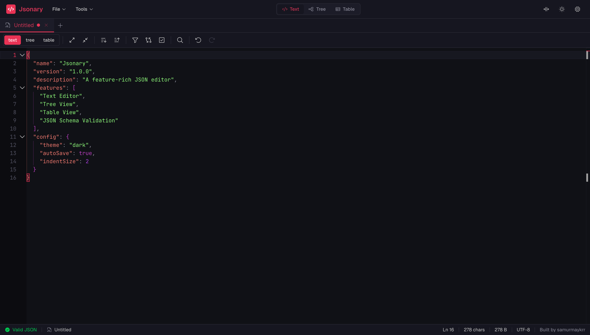
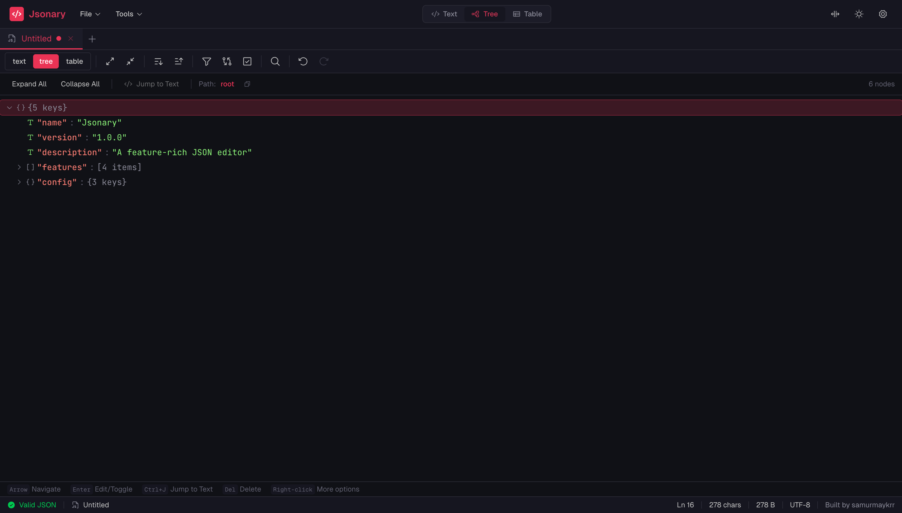
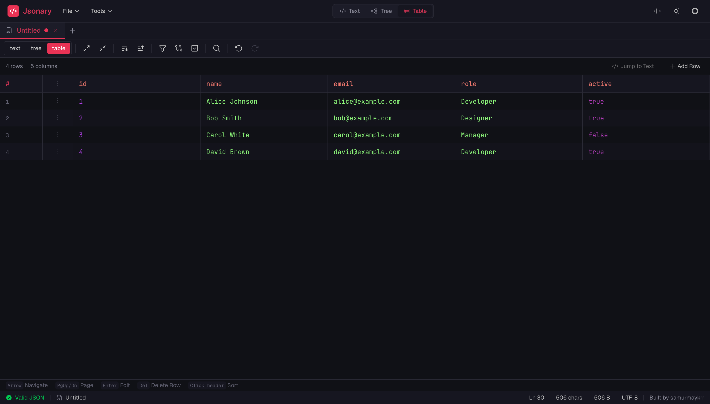

# Jsonary

A feature-rich, browser-based JSON editor built with React and TypeScript. Edit JSON with multiple view modes, powerful tools, and a modern interface.



## Features

### Multi-View Editing
- **Text Editor** - Full-featured code editor with syntax highlighting, code folding, line numbers, search/replace, and virtualization for large files



- **Tree Editor** - Hierarchical tree view with inline editing, expand/collapse, breadcrumb navigation, and keyboard navigation



- **Table Editor** - Spreadsheet-like view for arrays of objects with sorting, column resizing, and row operations

### Multi-Document Support
- Multiple documents open simultaneously with tab bar
- Drag-and-drop tab reordering
- Document duplication
- Dirty state tracking for unsaved changes

### JSON Tools
- Format/prettify with customizable indentation
- Compact/minify
- Sort object keys (A-Z / Z-A)
- JSON repair for malformed input
- JSONPath querying with filter expressions
- JSON Schema validation (AJV)
- JSON Schema generation from sample JSON
- JSON diff/compare with side-by-side view

### Import/Export
- **CSV** - Import and export CSV files with preview
- **YAML** - Export JSON to YAML format
- **TOML** - Export JSON to TOML format
- **TOON** - Export to Token-Oriented Object Notation (reduces LLM token usage by 30-60%)
- **JSON Schema** - Generate JSON Schema from sample JSON data

### Editor Capabilities
- Syntax highlighting with custom tokenizer
- Code folding (collapse/expand regions)
- Search and replace with regex support
- Go to line functionality
- **Command Palette** (Ctrl/Cmd+K) - Quick access to all features
- Error indicators with hover details
- Undo/Redo with full history
- Auto-close brackets and smart indentation
- 30+ keyboard shortcuts for efficient editing

### Persistence
- Session persistence using IndexedDB
- Automatic save (debounced)
- Session restore on reload
- Settings persistence in localStorage

### Customization & PWA
- Light/Dark theme (with system preference option)
- Configurable font family and size (Google Fonts support)
- Adjustable tab size, line wrapping, and other editor behaviors
- **Progressive Web App (PWA)** - Install as standalone app, works offline
- Split view for side-by-side comparison
- Responsive design optimized for mobile devices

## Tech Stack

- **React 19** + **TypeScript** (strict mode)
- **Vite 7** - Build tool and dev server
- **Tailwind CSS 4** - Utility-first styling
- **Million.js** - React performance optimization
- **AJV** - JSON Schema validation
- **jsonrepair** - JSON repair
- **js-yaml** - YAML conversion
- **@iarna/toml** - TOML conversion
- **toon** - TOON format support
- **idb-keyval** - IndexedDB persistence
- **Web Workers** - Offload heavy processing
- **PWA Support** - Progressive Web App with offline capabilities

## Getting Started

### Prerequisites
- Node.js 25.2.1 (use `nvm use` if you have nvm installed)

### Development
```bash
# Install dependencies
pnpm install

# Start development server
pnpm dev

# Build for production
pnpm build

# Preview production build
pnpm preview

# Run tests
pnpm test

# Run tests with coverage
pnpm test:coverage
```

### Docker
```bash
# Build and run production container
docker-compose up

# Run development container
docker-compose --profile dev up
```

### Contributing
See [CONTRIBUTING.md](CONTRIBUTING.md) for development guidelines.

## Scripts

| Command | Description |
|---------|-------------|
| `pnpm dev` | Start development server (Vite) |
| `pnpm build` | Build for production |
| `pnpm preview` | Preview production build |
| `pnpm test` | Run tests in watch mode |
| `pnpm test:run` | Run tests once |
| `pnpm test:coverage` | Generate coverage report |
| `pnpm lint` | Run ESLint |
| `docker-compose up` | Run production build in Docker |
| `docker-compose --profile dev up` | Run dev server in Docker |

## Project Structure

```
src/
├── components/
│   ├── editor/         # Editor views (text, tree, table)
│   ├── layout/         # App shell (Header, TabBar, StatusBar)
│   └── ui/             # Reusable UI components (Command Palette, Modals, etc.)
├── config/             # App configuration and branding
├── hooks/              # Custom React hooks
├── lib/                # Core utilities
│   ├── csv/            # CSV import/export
│   ├── diff/           # JSON diff algorithms
│   ├── file/           # File open/save operations
│   ├── fonts/          # Google Fonts loader
│   ├── json/           # JSON processing (tokenizer, parser, formatter, query, repair, validator)
│   ├── schema/         # JSON Schema generation
│   ├── storage/        # IndexedDB persistence
│   ├── toml/           # TOML export
│   ├── toon/           # TOON format export
│   └── yaml/           # YAML export
├── store/              # State management (Context + useReducer)
├── types/              # TypeScript definitions
└── workers/            # Web Workers for heavy computation
```

## Keyboard Shortcuts

Press `Ctrl/Cmd+K` to open the Command Palette for a searchable list of all available commands.

### Essential Shortcuts
- `Ctrl/Cmd+K` - Open Command Palette
- `Ctrl/Cmd+N` - New Document
- `Ctrl/Cmd+O` - Open File
- `Ctrl/Cmd+S` - Save File
- `Ctrl/Cmd+F` - Find
- `Ctrl/Cmd+H` - Find and Replace
- `Ctrl/Cmd+Shift+F` - Format JSON
- `Ctrl/Cmd+Shift+M` - Compact JSON
- `Ctrl/Cmd+1/2/3` - Switch to Text/Tree/Table view
- `Ctrl/Cmd+G` - Go to Line
- `F8` - Go to Error

See the Command Palette (Ctrl/Cmd+K) for a complete list of shortcuts.

## CI/CD

This project includes a GitHub Actions workflow that automatically:
- Runs ESLint for code quality
- Executes the full test suite
- Performs TypeScript type checking
- Builds the application
- Uploads coverage reports to Codecov

## Changelog

See [CHANGELOG.md](CHANGELOG.md) for a list of changes in each version.

## Contributing

Contributions are welcome! Please read [CONTRIBUTING.md](CONTRIBUTING.md) for guidelines.

## License

MIT
